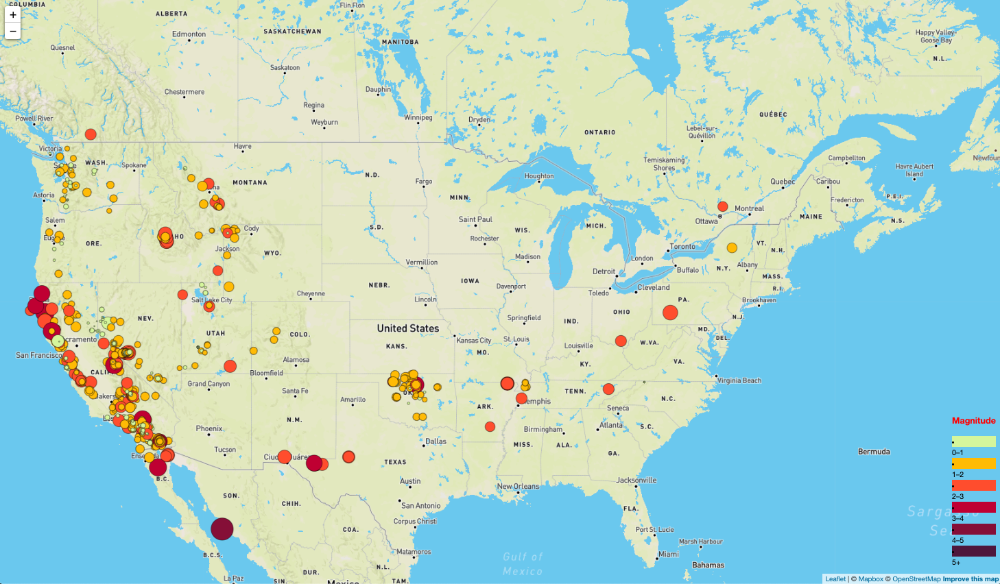
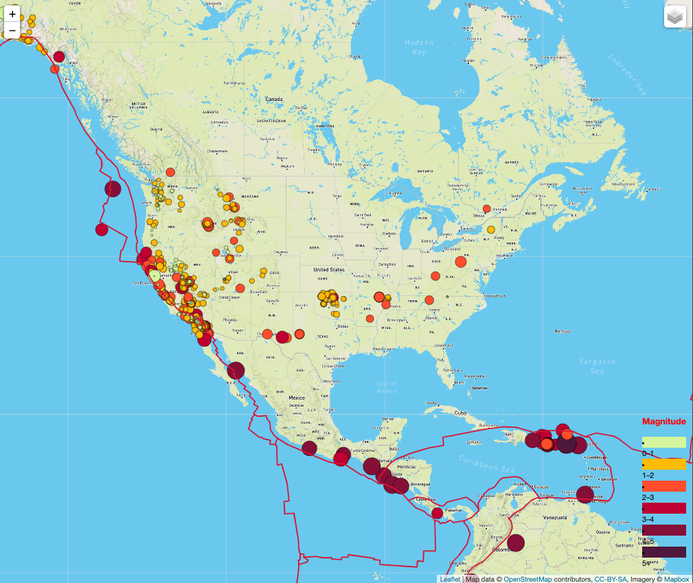

# Leaflet-Challenge
## Visualizing Data with Leaflet

Welcome to the United States Geological Survey, or USGS for short! The USGS is responsible for providing scientific data about natural hazards, the health of our ecosystems and environment; and the impacts of climate and land-use change. Their scientists develop new methods and tools to supply timely, relevant, and useful information about the Earth and its processes. 

The USGS is interested in building a new set of tools that will allow them visualize their earthquake data. They collect a massive amount of data from all over the world each day, but they lack a meaningful way of displaying it. Their hope is that being able to visualize their data will allow them to better educate the public and other government organizations (and hopefully secure more funding..) on issues facing our planet.
Your first task is to visualize an earthquake data set.

1. **Get your data set**

The USGS provides earthquake data in a number of different formats, updated every 5 minutes. Visit the [USGS GeoJSON Feed](http://earthquake.usgs.gov/earthquakes/feed/v1.0/geojson.php) page and pick a data set to visualize. When you click on a data set, for example 'All Earthquakes from the Past 7 Days', you will be given a JSON representation of that data. You will be using the URL of this JSON to pull in the data for our visualization.

2. **Import & Visualize the Data**
These mapw were created by using Leaflet that plots all of the earthquakes from the data set based on their longitude and latitude. Daata markers reflect the magnitude of the earthquake by their size and and depth of the earth quake by color. As you can see, earthquakes with higher magnitudes appear larger and earthquakes with greater depth appear darker in color. One canm get more additional detailed information about earthquake when a marker is clicked. On the lower left side, there is a legend that scaled the magnitude of the earthquake by color.

This is how earthquake map looks like:

As you can see, most the eartquakes occur on the west of side of the America, in states like California, Oregon and Nevada.
 
   

This map displays tectonic plates across America. According to eartquake glossary, Plate Tectonics is the theory supported by a wide range of evidence that considers the earth's crust and upper mantle to be composed of several large, thin, relatively rigid plates that move relative to one another. Slip on faults that define the plate boundaries commonly results in earthquakes. Several styles of faults bound the plates, including thrust faults along which plate material is subducted or consumed in the mantle, oceanic spreading ridges along which new crustal material is produced, and transform faults that accommodate horizontal slip (strike slip) between adjoining plates. as you can see, there is a correlation between tectonic plates location and eartquake locations, as the above theory explains.

   

   

   

- - -

